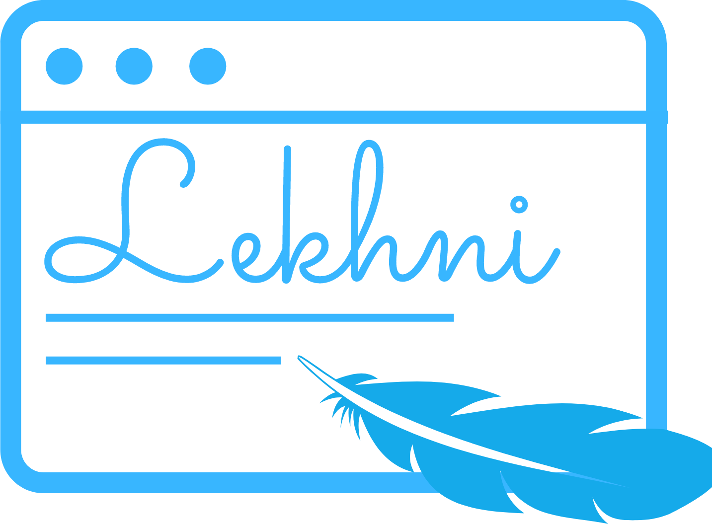

# Lekhni
 

**Lekhni** which translates to “stylus” , an object for writing, is a space to express yourself by writing blogs and reading others.

Here are few snapshots of the page:

* **Home Page**
  

* **Sign Up**
  

* **Sign In**
  

* **All the articles of current user**
  

* **Adding/Editing an Article**
  
